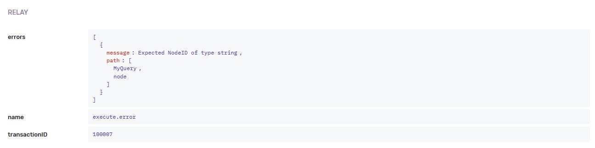
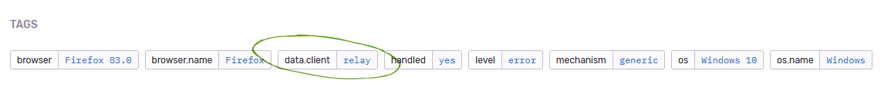

# `relay-sentry` [](https://github.com/maraisr/relay-sentry/actions?query=workflow:CI+branch:main) [](https://codecov.io/gh/maraisr/relay-sentry)

> Relay log function that enriches Sentry with Relay lifecycles and GraphQL data

## ⚙️ Install

```sh
yarn add relay-sentry
```

## 🧱 Usage

```ts
import { logFunction } from 'relay-sentry';
import { Environment } from 'relay-runtime';

const environment = new Environment({
	log: logFunction(),
	network,
	store,
});
```

If you're wanting to also include the
[GraphQL `errors` array](http://spec.graphql.org/draft/#sec-Errors) to the
Sentry exception context. You can throw a _custom_ `Error` class that contains a
property called `graphqlErrors`. Internally we look for that key on the error
object, and send it.

Under the hood it uses `@sentry/minimal` so there is no discrepancy between
Node/Browser runtimes.

<details>
<summary>TypeScript users, we export an interface to help:</summary>

```ts
import type { ErrorWithGraphQLErrors } from 'relay-sentry';

declare global {
	interface Error extends ErrorWithGraphQLErrors {}
}
```

</details>

## 🎢 What does it add?

### Breadcrumbs ✅

Leaves a debug/info breadcrumb trail for all intermediate life cycle events.


> At this stage it doesn't filter any variables, but if there's a need for
> it—submit a PR 🕺

### Contexts ✅

If the error was as a result of a Relay or Relay Network error, then this will
include the remote errors array payload.



### Customisable Tag ✅

Apply's a tag when the exception was as a Result of Relay.



## 🔎 API

### `logFunction(options?: Options): LogFunction`

`Options`

| Option        | Description                                  | Default         |
| ------------- | -------------------------------------------- | --------------- |
| `tag: string` | The tag key used when raising a Sentry error | `"data.client"` |

## ⁉ Help

<details>
<summary>How can I log something custom?</summary>

```ts
import { logFunction } from 'relay-sentry';
import { Environment } from 'relay-runtime';

const environment = new Environment({
	log: (logEvent) => {
		logFunction(logEvent);
		// Do your logs
	},
	network,
	store,
});
```

</details>

<details>
<summary>The error's context looks like <code>[ [Object] ]</code></summary>

When you're running `Sentry.init` set the
[`normalizeDepth`](https://docs.sentry.io/platforms/javascript/configuration/options/#normalize-depth)
to something bigger, maybe 10.

</details>

## License

MIT © [Marais Rossouw](https://marais.io)
